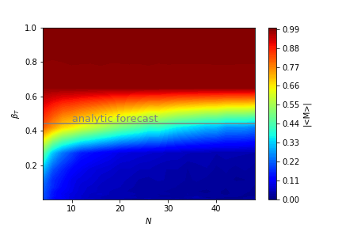

# 2D Ising Model Simulation

A minimal python example for a simulation of the 2D Ising model. Implemented algorithms are a local metropolis update, a parallelized red/black or chessboard Metropolis update, and the Wolff cluster algorithm (single cluster algorithm).

## Exemplary Results

### 1. Visualization of the Monte Carlo History

Course of the magnetization for different configurations
System size: N = 50, Temperature: beta =0.1

Visualization of the changes in the system due to the wolff algorithm.

https://user-images.githubusercontent.com/37295627/128606822-3a1492f5-4f9d-4370-86e8-205899296fea.mp4

### 2. Phase transition with critical Temperature
The magnetization is plotted over the inverse temperature showing the existence of a critical temperature.

### 3. System size scaling
Step 2 is repeated for several system sizes. At low system sizes finite size effects dominate. 

